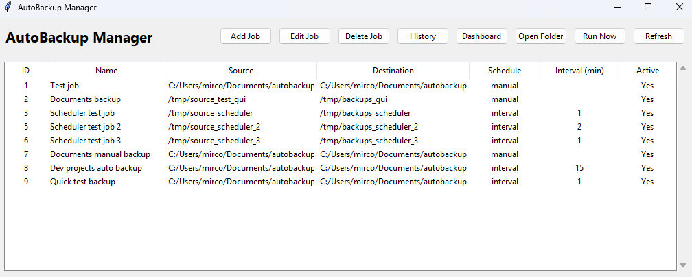
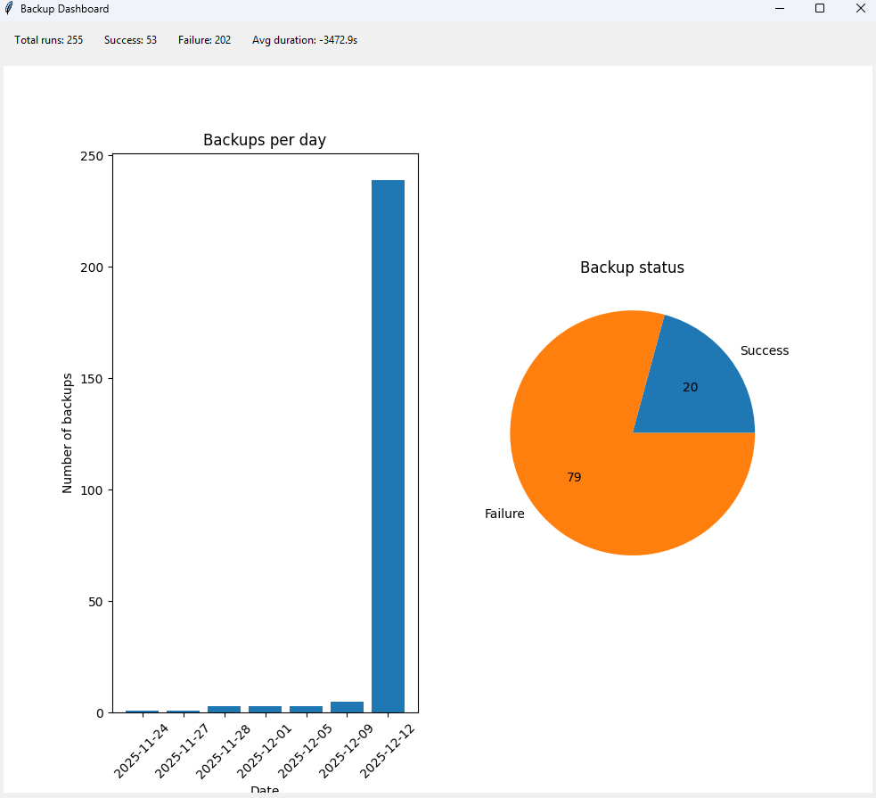
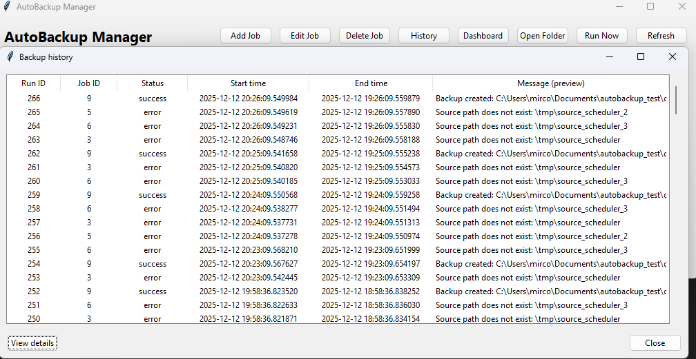

<p align="center">
  
</p>

<h1 align="center">🗂️ AutoBackup Manager</h1>

<p align="center">
  Desktop backup manager built with <b>Python</b>, <b>Tkinter</b> and <b>PostgreSQL</b>, 
  with scheduled jobs, history, analytics dashboard and an integrated folder viewer.
</p>

---

## 📸 Screenshots

### Main window – Backup jobs

<p align="center">
  
</p>

### Dashboard – Backups overview

<p align="center">
  
</p>

### History & Run details

<p align="center">
  
</p>

---

## 🚀 Overview

**AutoBackup Manager** is a desktop application that lets you:

- Create backup jobs for any folder on your system  
- Run jobs manually or on a schedule  
- Inspect execution history and detailed logs  
- Visualize backups over time with charts  
- Open backup destinations through an integrated folder viewer  

The goal of this project is to be both a **learning tool** and a **practical desktop backup utility**.

---

## 🚀 Features

### ✅ Backup Jobs
- Create, edit and delete backup jobs
- Configure:
  - **Source folder**
  - **Destination folder**
  - **Schedule type**: `manual`, `interval`, `daily`
  - **Interval (minutes)** for interval-based jobs
  - **Active** flag (enable/disable without deleting)
- Jobs are stored in PostgreSQL using SQLAlchemy ORM

### ✅ Manual Backup Execution
- Run any job immediately with **Run Now**
- Validation of:
  - Missing source/destination folders
  - Non-directory paths
- Backups are created as **ZIP archives** with timestamped filenames:
  - `job_<id>_YYYYMMDD_HHMMSS.zip`
- Clear success/error messages in the UI

### ✅ Backup History
- History window showing:
  - Run ID
  - Job ID
  - Status (`success` / `error`)
  - Start and end timestamps
  - Message preview
- “View details” window with:
  - Job name
  - Output file path
  - Full log/message text

### ✅ Dashboard / Analytics
- **KPIs** on top:
  - Total runs
  - Success count
  - Failure count
  - Average run duration
- **Charts (matplotlib)**:
  - Bar chart: *backups per day*
  - Pie chart: *success vs failure* 

### ✅ Destination Folder Viewer
- Internal Tkinter window to list folder contents
- Scrollable file viewer  
- Option to open with:
  - system file manager (xdg-open, open, explorer.exe)  
  - fallback for terminal file managers  
- Graceful error handling when the path doesn't exist

### ✅ Clean Project Architecture
- `backup_engine.py` — core backup logic  
- `scheduler.py` — scheduling system (manual mode ready, auto mode coming soon)  
- `gui.py` — graphical interface (Tkinter)  
- `models.py` — SQLAlchemy ORM models  
- `db.py` — database session handling 
- `config.py` — configuration from `.env`
- `main.py` — application entry point (logging, scheduler + GUI bootstrap)

---

## 🧱 Tech Stack

- **Python 3.12**
- **Tkinter** (GUI)
- **PostgreSQL + SQLAlchemy**  
- **matplotlib** (dashboard charts)
- **Docker & Docker Compose** (database container)
- **Pyright** for static type checking

---

## 📦 Installation

1. Clone the repository
```bash
git clone https://github.com/your-user/autobackup-manager.git
cd autobackup-manager
``` 

2. Create and activate a virtual environment
```bash
python -m venv .venv
source .venv/bin/activate  # Linux / macOS
.venv\Scripts\activate     # Windows
```

3. Install dependencies
```bash
pip install -r requirements.txt
```

4. Start PostgreSQL via Docker
```bash
docker compose up -d db
```

5. Run the application
```bash
python -m autobackup.main
```

---

## File Structure
```bash
autobackup-manager/
│
├── assets/
│   ├── autobackup_icon.png
│   ├── screenshot_jobs.png
│   ├── screenshot_dashboard.png
│   └── screenshot_history.png
│
├── src/
│   └── autobackup/
│       ├── __init__.py
│       ├── backup_engine.py
│       ├── config.py
│       ├── db.py
│       ├── gui.py
│       ├── main.py
│       ├── models.py
│       └── scheduler.py
│
├── AutoBackupManager.spec
├── docker-compose.yml
├── pyproject.toml
├── requirements.txt
├── requirements-dev.txt
└── README.md
```

---

## 🧪 Type Checking (Pyright)

Run:
```bash
npx pyright
```

Result after improvements:

- 0 errors, 0 warnings, 0 informations

---

## 🧱 Building the Windows executable (PyInstaller)

The project can be packaged as a standalone **Windows executable (.exe)** using PyInstaller.

> Requirements:
> - Python 3.12+ installed on Windows (`py` launcher available)
> - PostgreSQL running and accessible with the same credentials as in `.env`

### 1. Clone or copy the project to Windows

Example path:

```text
C:\Users\mirco\dev\autobackup-manager
```
- Make sure the following files exist in the project root:
- pyproject.toml
- requirements.txt
- .env
- src\autobackup\main.py (application entry point)

### 2. Create and activate a virtual environment
```
cd C:\Users\mirco\dev\autobackup-manager

py -m venv .venv
.\.venv\Scripts\activate
```

### 3. Install dependencies
```
pip install -r requirements.txt
pip install pyinstaller
```

### 4. Build the executable with PyInstaller
```
pyinstaller --name AutoBackupManager --onefile --windowed src\autobackup\main.py
```
This will generate the following structure:
```
dist\
  AutoBackupManager.exe   # Windows executable
build\
  ...                     # PyInstaller build artifacts (can be ignored)
```

### 5. Running the executable
From the project root:
```
cd C:\Users\mirco\dev\autobackup-manager
.\dist\AutoBackupManager.exe
```
The application will:
- Read configuration from .env (database, environment, etc.)
- Connect to PostgreSQL
- Start the background scheduler
- Open the Tkinter GUI (AutoBackup Manager)

You can then create jobs, run backups, inspect history and open destination folders.

---

## 📝 Roadmap
Implemented ✅
- GUI CRUD for backup jobs
- Manual job execution
- History + details viewer
- Dashboard with charts
- Internal folder viewer
- Path validation & error handling
- Logging and structured startup flow
- PyInstaller build for Windows
- Pyright-clean codebase

Planned 🚧

- More flexible schedules (daily/weekly/hourly with UI controls)
- System tray integration
- Email / desktop notifications
- Log export (CSV/JSON)
- Automatic cleanup of old backups (retention policy)
- Windows installer (.msi / setup.exe)

---

## 🤝 Contributing

Pull requests are welcome!
For major changes, please open an issue to discuss what you'd like to change.

---

## 📜 License

MIT License — feel free to use this project for learning or production.

---

## 🧑‍💻 Author
Marcos Vinicius Thibes Kemer
